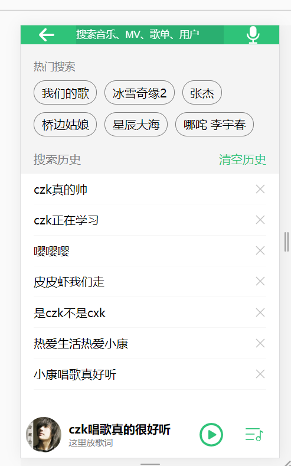
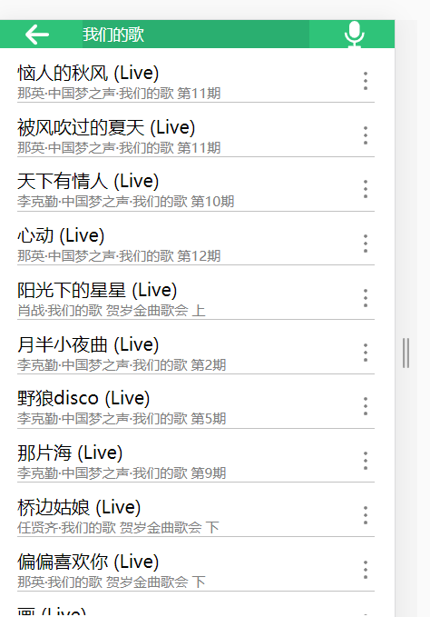

# qq-music

## 下载

```
npm install
```

### 运行

```
npm run serve
```


### 前言

​	这是一个朝码农奋斗的有志青年的故事

​	最近学习了vue,加上肺炎严重（干嘛吃蝙蝠啊），待在家里出不去，实在是无聊，就想用vue写一个项目，由于本人喜欢音乐，正好看见手机上有qq音乐，就打算从0开始写一个qq音乐，自娱自乐，哈哈

​	但是后端方面的知识没有学过，也不知道能不能写完,难度好大啊，页面好复杂....


### 目前已完成功能

首页     				2020/2/2

歌单详情页         2020/2/4

播放歌曲             2020/2/5

搜索歌曲             2020/2/8
歌词部分完成         2020/2/9
歌词进度条完成       2020/2/10


很多细节还未完成，很多界面也没有写，将持续优化


***未完待续！！！***


### 技术

"axios": "^0.19.2",

"better-scroll": "^1.15.2",

"core-js": "^3.4.4",

"vue": "^2.6.10","

vue-router": "^3.1.5","

vuex": "^3.1.2"

### 接口

不是很懂后端，接口都是qq音乐的数据接口，自己弄跨域都花了好长时间

未来有机会学习学习，做一个全栈程序员！

### 页面展示




